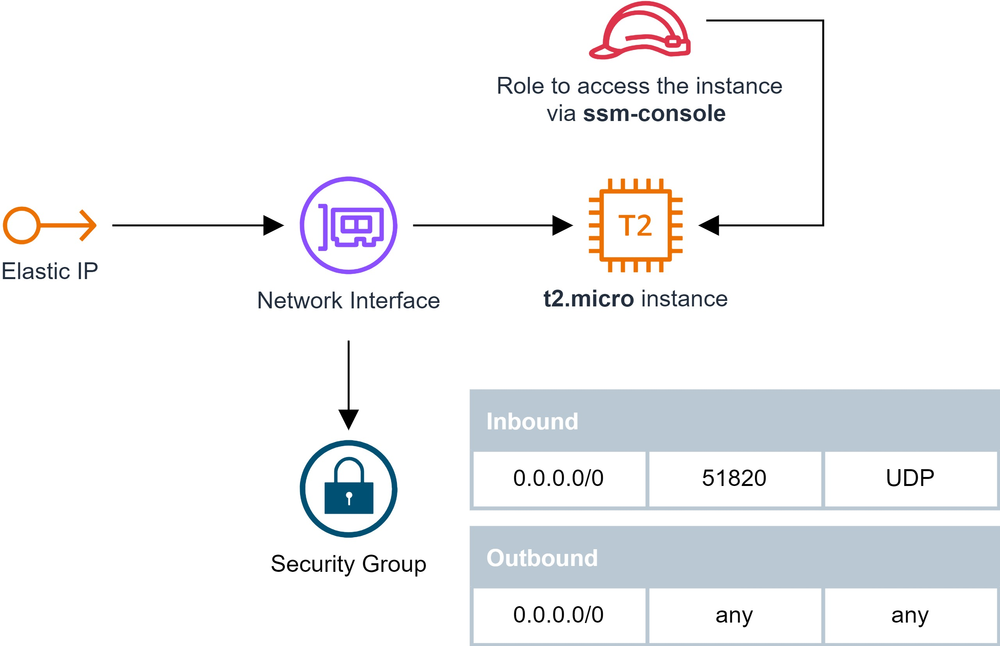

# CloudFormation stack to setup EC2 instance running pivpn/pi-hole

In this stack: 

- Pi-hole® is configured to use Quad9 DNS
- PiVPN is configured to use Wireguard
- PiVPN is configured for Ubuntu AMI/ubuntu user
- EC2 instance uses a t2.micro instance
- EC2 uses a EBS encrypted SSD generic volume
- Access to the instance is restricted via Session Manager only (no SSH)

## Further readings
- [yawnbox blog post](https://yawnbox.com/blog/wireguard-dns-ad-blocking/) which inspired me to do this template
- Pi-hole® [repository](https://github.com/pi-hole/pi-hole)
- PiVPN [repository](https://github.com/pivpn/pivpn)

## Thanks to
[@mrkrash](https://github.com/mrkrash), one day in Genova, unintentionally and without knowing, he reminded me that I never setup a VPN for fun and led me to ask myself "Why?"